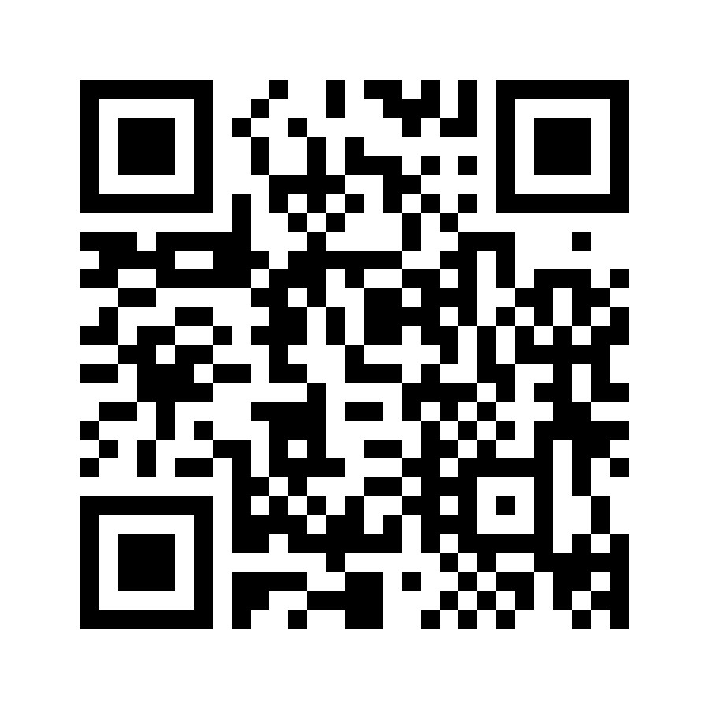
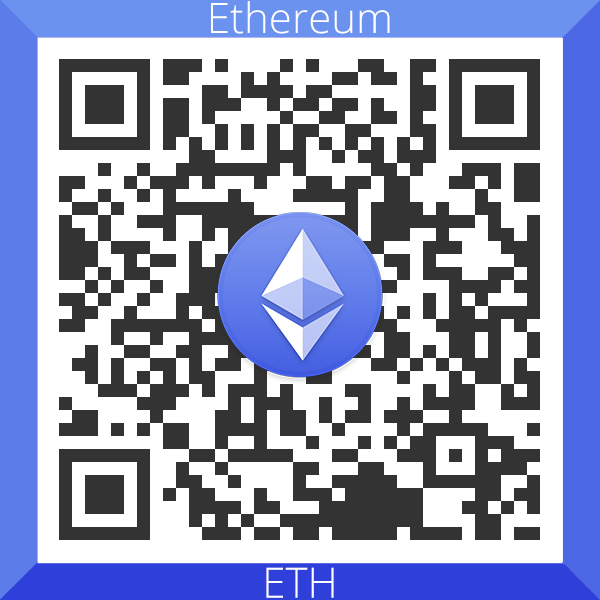
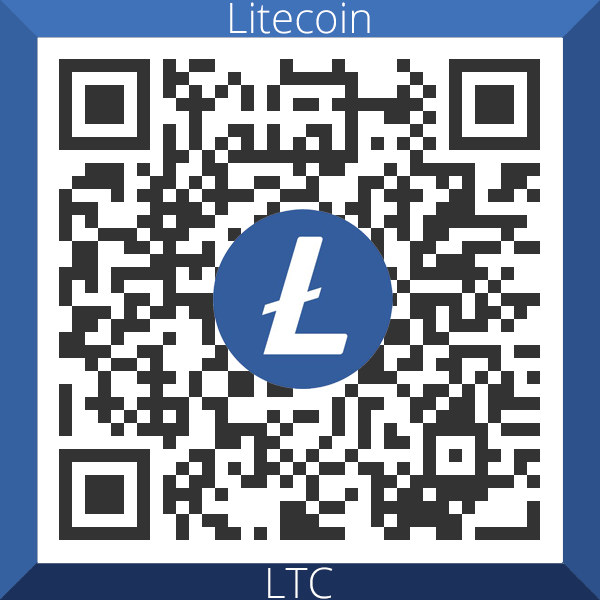
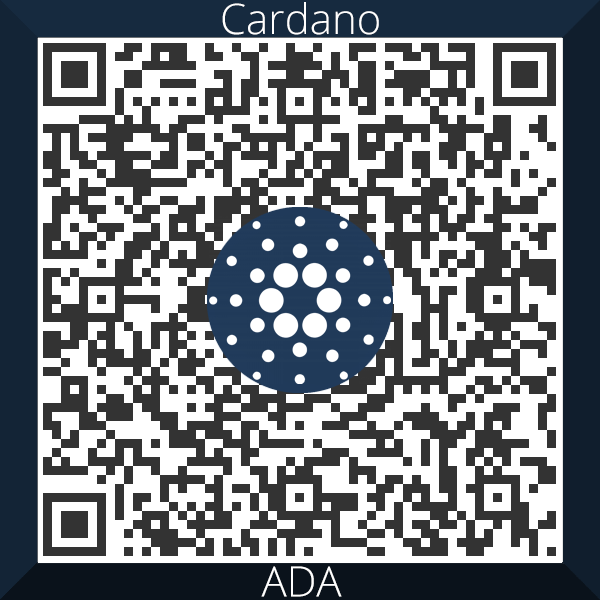

# 🎓🎓 SPŠE - maturita 🎓🎓

## Co tento repozitář obsahuje?

- ### Vyřešené maturitní otázky pro obor IT na SPŠE Pardubice.
- ### Materiály pro maturitu z HW, PS, WA, ČJ, AJ a MA.
- ### Všeobecné informace ke zkouškám, jak probíhají a nějaké tipy na výběr MP a VŠ.

  

---
## BASIC FAQ 
---

### Jak je repozitář strukturovaný?
- Všeobecné informace o maturitě jsou v tomto souboru.
- Každý předmět má svou složku, kde jsou vyřešené otázky a podrobnější informace jak zkouška probíhá.
- Informace k Maturitnímu Projektu je v souboru [`FaQ\MP.md`](FaQ/MP.md).
- Informace o výběru Vysoké Školy je v souboru [`FaQ\VŠ.md`](FaQ/VŠ.md).

### Z jakého roku jsou otázky?
- Otázky jsou z maturit roku 2023.

### Proč jsi tento repozitář vytvořil?
- Chci dalším ročníkům předat své zkušenosti a pomoci jim s přípravou na maturitu.
- Přišlo mi, že škola nám neposkytla nějaké celistvé informace o maturitě a spíše jsem informace získával od ostatních až během zkoušek..

### Jsou otázky vyřešené správně? Co když najdu chybu?
- Řekl bych, že otázky jsou vyřešené velmi kvalitně. Bral jsem dost informací z vyřešených materiálů z minulých let, materiály procházelo více lidí a prošly někola revizemi.
- Přesto, pokud najdete nějakou chybu, neváhejte mně napsat na info@k-cermak.com a já rád chybu opravím.

### Je maturita formalita?
- Rozhodně je lepší se mírně strestovat a připravit se na ni a pak si říct, že to byla formalita, než se na to vykašlat..

### Jak vlastně maturita funguje? Co to je sloh / didaktický test / ústní?
- Maturita se skládá ze 3 částí - slohů, didaktických testů a ústních.
- Sloh můžete psát ze 2 předmětů - češtiny a angličtiny - z češtiny je povinný pro všechny, z angličtiny jen pro ty, co nejdou povinně na matiku a vybrali si angličtinu (viz dále co si vybrat). Píšou se přibližně v půlce dubna.
- Didaktický test je celkem ze 2 předmětů - češtiny a pak matiky / angličtiny. Tento test dělá centrálně Cermat (takže ho píšou všichni maturanti ve stejnou chvíli a je na všech školách stejný). Píše  se na začátku května po uzavření klasifikace.
- Ústní zkouška je pak nejtěžší část maturit - je celkem ze 4 předmětů - ČJ, WA, HW / PS a případně AJ. Dále obsahuje obhajovu maturitní práce. Ústní zkoušky probíhají většinou poslední dva týdny v květnu.
- Na to, abyste maturitu udělali, musítě splnit všechny zkoušky. Pokud například neuděláte sloh z ČJ, k ústním i didaktickým testům sice jdete, ale maturitu neuděláte a tedy sloh budete muset psát znovu v září. Pokud ale například nedáte ústní z ČJ a sloh ano, opakujete v září jen tu zkoušku, kterou jste neudělali (takže jen ústní, sloh už ne).
- Pokud nedokončite 4. ročník (máte z něčeho N nebo 5), tak k maturitě nejdete (až na slohy) a šanci máte jít až v září.
- Všemu se detailně věnuji v dalších sekcích - viz další.

### Mám jít povinně na matiku nebo na angličtinu?
- Mezi povinnými předměty si můžete zvolit, zda chcete jít na matiku a nebo na angličtinu.
- U matiky máte výhodu, že děláte jen jednu zkoušku - didaktický test - takže žádné ústní a logicky ani sloh.
- Úspěšnost u matiky je ale o dost menší než u angličtiny, angličtinu ve své podstatě udělá i úplný debil.
- U matiky musítě didaktický test napsat minimálně na 33 %, což je poměrně málo, ale přesto je neúspěšnost docela velká.
- Pokud jste dobří v matice (řekněme máme jedničky / dvojky), přípravujete se ještě například na SCIO testy z matiky, tak doporučuji spíše zkusit 1 / 2 testy a pokud budete mít slušný výsledek, tak se na angličtinu vykašlat a jít na matiku. Sice i když je angličtina jednoduchá, je to zbytečný stres o svaťáku navíc.
- Pokud si ale u matiky nevěříte, jste průměrní či podprůměrní a nechcete riskovat, tak doporučuji jít na angličtinu. Je to sice větší opruz, ale je to jednodušší a uděláte to.

### Máš ještě nějaké další materiály od starších ročníků?
- Nějaké materiály jsou k dispozici tady (ty jsou ale už dost staré): https://uloz.to/file/G8DS9hD5F0U6/formalita-rar.
- Ještě jsem pak měl nějaké materiály z minulého roku, ale byly v nich nějaké menší nepřesnosti, navíc nemám od dotyčného svolení je sdílet, takže proto je zde nebudu uvádět.  

### Proč máš vše ve Wordu a ne třeba v Notionu?
- Word mi přišel na delší dokumenty lepší než Notion, navíc je to takový standard (i protože přesně vím, jak se to vytiskne).

### Můžu ti přispět? ❤️❤️❤️

- Pokud ti mé materiály pomůžou a jsi ochoten ocenit moji snahu nějakou kačkou, můžeš tak učinit přes QR kódy níže:
    ### Účet: 2262692018/3030
     
    
    
    ### Crypto:
    - **BTC:** bc1qasgxc552wjqlpcm9vt7ucmw6p4zuz007dxh8n4  
     
    
     
     

    - **ETH:** 0x29Ca9054B2241aB39010a1434fb50e504EE10871
     
    
     
     

    - **LTC:** ltc1qxpgp3jc5jyem6096n48w48qqrwsrnj5eq9j890
     
    
     
     

    - **ADA:** addr1q8c89cet02nyql4ygj96s0cz5ntusgzxfzuykfngmaf0zt2ftj7wrayqm7dx52et7k7tkjjl2edan0wykww6q4twn79shzx8vn
     
    
     
     
    
    
    - **DOGE:** DCYFq9hPcVJkYKAgttkRXNSAkfbjEmLGdo
     
    
     
     

    ### A pokud jsi chudý student a všechny prachy prochlastáš, můžeš mi alespoň dát hvězdičku na GitHub repozitář…

    
© Karel Čermák 2023, see [license](LICENSE.md) for more details.